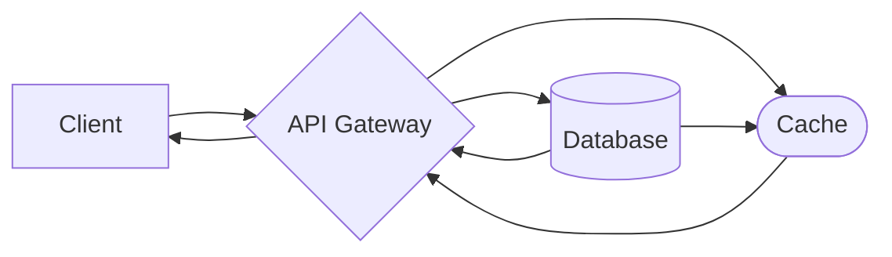

# 🐈‍⬛ bigcat

**Designing a Concert Ticket Booking System**

Using concert ticket [booking system outline](https://github.com/ashishps1/awesome-low-level-design/blob/main/problems/concert-ticket-booking-system.md) from this low-level design challenge, the code within this project creates an API on top of the system. Allowing for some modifications, the API closely adhears to the original requirements.

## Requirements
1. The concert ticket booking system should allow users to view available concerts and their seating arrangements. 
2. Users should be able to search for concerts based on various criteria such as artist, venue, date, and time.
3. Users should be able to select seats and purchase tickets for a specific concert.
4. The system should handle concurrent booking requests to avoid double-booking of seats.
5. The system should ensure fair booking opportunities for all users.
6. The system should handle payment processing securely.[^*]
7. The system should generate booking confirmations and send them to users via email or SMS.[^*]
8. The system should provide a waiting list functionality for sold-out concerts.[^*]

[^*]: Future implementation

### Assumptions
- The front-end allows users to book multiple tickets for a single concert
- The front-end shows which seats are available, thus satisifying requirement 1

### Future Implementations
- Add location to search
- User to get list of bookings and booking data
- Add non-GA tickets to cache, preventing a user from booking if no more seats
- Add a queue for users attempting to reserve tickets
    - Could be a better use for the RESERVED seat status
- Add payment verification
    - Could be a better use for the PENDING booking status
- Hosting in the cloud
- Rate limiting for too many requests from same user
- Seperating booking logic and CRUD into their own classes, using a microservice architecture, leaving the enpoints to call from the script
- API Autherizaton
- Implement a payment gateway or include an API like Stripe, satisfying requirement 6
- Implement emailing, satisifying requirement 7
- Implement waitlist once sold out, satisifying requirement 8

## System Design
This is a python-based project that uses FastAPI endpoints to connect to connect a client to the booking service housed in the API Gateway. The user can search for or book tickets. Once their data is validated, the database updates and the client recieves a response.

### Design Breakdown
#### Data Classes
The database uses a SQL-style approach with four tables: Concert, Seat, and Booking, User. The data is stored without normalization in a NoSQL database (Booking database breaks 1NF with multivalued attributes in the seats list).

- The **Concert** class represents a concert event, with properties such as ID, artist, venue, date and time, and a list of seats.
- The **Seat** class represents a seat in a concert, with properties like ID, seat number, seat type, price, and status. It provides methods to book and release a seat.
- The **Booking** class represents a booking made by a user for a specific concert and seats. It contains properties such as ID, user, concert, seats, total price, and status. It provides methods to confirm and cancel a booking.
- The **User** class represents a user of the concert ticket booking system, with properties like ID, name, and email.

#### Enumerations
- The **SeatType** enum represents the different types of seats available, such as regular, premium, and VIP.
- The **SeatStatus** enum represents the status of a seat, which can be available, booked, or reserved.
- The **BookingStatus** enum represents the status of a booking, which can be pending, confirmed, or cancelled.

#### Classes
- The **model** class handles all data and enum definitons
- The **main** class hosts the API and its endpoints
- The **test** class lists unit tests for the API
- The **util.mongo** class handles MongoDB connectivity for ETL and CRUD
- The **util.data** class handles creation of dummy data and ETL of MongoDB clusters

### Tech Stack Usage
FastAPI → high performance API buidler
pydantic → Data creation, validation, and standard practice use with FastAPI
MongoDB → document-based 

## API Endpoints
| Method | Endpoint               | Description                                                                                                                                                      |
|--------|------------------------|------------------------------------------------------------------------------------------------------------------------------------------------------------------|
| GET    | /concert               | Searches database for concert data based on given query. It is assumed that a concert_id will not be searched with an artist, venue, or date.                    |
| POST   | /booking               | Updates booking database based on a (group of) seat(s) a user wishes to pay for.                                                                                 |
| PATCH  | /booking/ {booking_id} | Cancels a booking for a given booking_id. Does not delete the booking in the database, instead releases the seats booked and changes booking status to canceled. |
