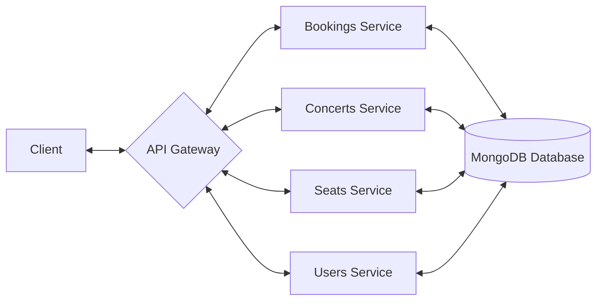

# 🐈‍⬛ bigcat

bigcat is a concert ticketing system similar to Ticketmaster or Eventbrite. The purpose of this project is to display and expand my API buidling and systems architecture skills. Born from the [booking system outline](https://github.com/ashishps1/awesome-low-level-design/blob/main/problems/concert-ticket-booking-system.md) low-level design challenge, this code uses it as a schema for building out a robust API.

## System Design
This is a python-based project that uses FastAPI endpoints to connect to connect a client to the booking service housed in the API Gateway. The user can search for or book tickets. Once their data is validated, the database updates and the client recieves a response.

## Endpoints Documentation
Click the links below to see more details on each service's endpoints
- [Auth](docs/auth.md)
- [Bookings](docs/bookings.md)
- [Concerts](docs/concerts.md)
- [Deats](docs/seats.md)
- [Users](docs/users.md)
